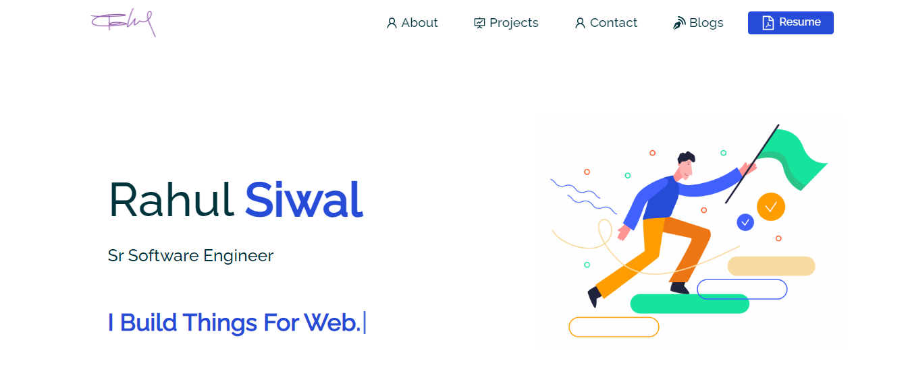
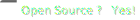

  

 

# React-JS-Portfolio >> <a href="http://www.rsiwal.com?ref=github_readme" target="_blank">rsiwal.com</a>
This is my personal portfolio developed with React JS Framework.
 

  

## Website Features

**📖 Multi Page Website**

**🎨 Styled with React-Bootstrap**

**🌸 Custom CSS for design with centralized colors**

**📱 Responsive Website**

**📁 Proper Managed Code**

## User Requests
  - <a href="https://github.com/crsiwal/React-JS-Portfolio/issues">Report a bug</a> I will try to fix this asap.
  - <a href="https://github.com/crsiwal/React-JS-Portfolio/issues">Add new feature</a> I will add if it will be related to the portfolio.

## 

You can fork this repo to modify and make changes of your own. Please give me proper credit by linking back to [React JS Portfolio](https://github.com/crsiwal/React-JS-Portfolio). Thanks!

## Built With

My personal portfolio <a href="http://www.rsiwal.com/" target="_blank">rsiwal.com</a> which features some of my github projects as well as my resume and technical skills. 

This project was built using these technologies.

- React.js
- Node.js
- Javascript
- HTML5
- CSS3
- Bootstrap

## Getting Started

Clone down this repository. You will need `node.js` and `git` installed globally on your machine.

## 🛠 Installation and Setup Instructions

1. Installation: `npm install`

2. In the project directory, you can run: `npm start`

Runs the app in the development mode.\
Open [http://localhost:3000](http://localhost:3000) to view it in the browser.
The page will reload if you make edits.

## Usage Instructions

Open the project folder and Navigate to `/src/components/`.  
You will find all the components used and you can edit your information accordingly.

### Show your <a href="https://www.buymeacoffee.com/rsiwal" target="_blank">support<a> 💸

Give a ⭐ if you like my work!

